# Thistle Tea - C4 Architecture Diagrams

This document contains C4 model diagrams for the Thistle Tea WoW 1.12.1 server emulator.

## Level 1: System Context

Shows Thistle Tea in the context of its users and external systems.

## Level 2: Container

Shows the major containers (processes/applications) within Thistle Tea.

## Level 3: Component - Game Server

Shows the internal components of the Game Server container.

## Level 3: Component - Entity System Detail

Shows the entity component architecture in more detail.

## Data Flow Diagrams

### Player Login Flow

### Mob AI Tick Flow

### Cell Activation Flow

```mermaid
sequenceDiagram
    participant CA as Cell Activator
    participant H as Spatial Hash
    participant L as Entity Loader
    participant DB as Mangos DB
    participant S as Entity Supervisor

    loop Every 1 second
        CA->>H: Query all player positions
        H-->>CA: Player position list

        CA->>CA: Calculate active cells (with adjacency)
        CA->>CA: Diff with current active cells

        alt New cells to activate
            CA->>L: load_cell(map, cell_x, cell_y)
            L->>DB: Query creatures in cell
            DB-->>L: Creature list
            L->>DB: Query game objects in cell
            DB-->>L: GameObject list

            loop Each entity
                L->>S: start_child(entity_spec)
                S-->>L: {:ok, pid}
            end
        end

        alt Cells to deactivate
            CA->>S: Terminate entities in cell
        end
    end
```

